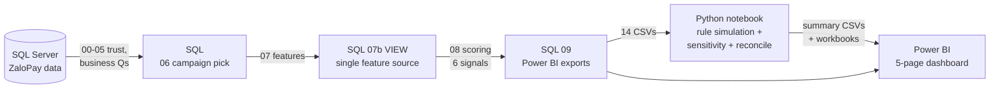

# ZaloPay Promotion-Abuse Detection — SQL → Python → Power BI

> End-to-end analytics that finds users extracting a ZaloPay promotion budget, quantifies the financial
> exposure, and recommends a review rule — built across **SQL Server → Python → Power BI**.

> **Note:** all "suspicious" labels are a **rule-based review score, not confirmed fraud.** The dataset has no
> confirmed fraud/bot labels, so results are review-prioritization signals, validated by SQL↔Python
> reconciliation — not ground truth.

---

## TL;DR

ZaloPay ran a large cashback/voucher **promotion campaign** (`CAMP_A`, 73 sub-campaigns). This project
scores every campaign user for **promo-abuse risk** on six behavioural signals, stress-tests candidate review
rules in Python, and surfaces the decision in a 5-page Power BI dashboard.

**Headline result:** **4.26% of scored users (3,671 of 86,170) absorb 26.94% of the credited promo budget
(≈1.89bn of 7.00bn ₫).** Promo cost is highly concentrated (one promotion, `PROMO_45`, = **74%** of spend),
and a **"medium balanced" review rule** flags 1,994 users (2.3% review workload) while capturing 23.9% of the
at-risk cost — recommended for **shadow-mode / high-priority manual review**, not automated blocking.

🔗 **Live dashboard walkthrough (YouTube):** https://youtu.be/_UaicJaSGOs · **Case studies:**
[SQL](docs/01_sql_stage.md) · [Python](docs/02_python_stage.md) · [Power BI](docs/03_powerbi_stage.md) ·
[Insights](docs/04_insights.md)

---

## The business problem

Promotions drive growth but attract **extractors** — users who farm cashback through referral rings, shared
devices/IPs, reciprocal transfer loops, and rapid discount redemption. Unmeasured, a promotion's budget quietly
leaks to a small group who won't retain. Questions answered:

1. How big is the promotion, and where does the money go?
2. Which users behave like extractors, and *why*?
3. How much budget is exposed to them?
4. What review rule balances **coverage vs. review workload**?
5. Did the spend buy lasting users?

## Headline numbers

| Question | Answer | Source |
|---|---|---:|
| Campaign size | 254,309 transactions · 90,555 users · 76.01% success | `campaign_overview` |
| Promo cost | **7.00bn ₫** credited (success-only) | `campaign_overview` |
| Cost concentration | **74.02%** in one promotion (`PROMO_45`) | `campaign_promotion_breakdown` |
| Scored population | **86,170** users (≥1 successful campaign txn) | `abuse_impact_summary` |
| Suspicious users | **3,671 (4.26%)** score ≥ 3 | scoring model |
| Their share of cost | **26.94%** (≈1.89bn ₫) | `abuse_impact_summary` |
| Peak daily exposure | **40.70%** of daily promo cost (22 Jul) | `campaign_daily_risk_summary` |
| Recommended rule | Medium-balanced: 1,994 flagged · 23.9% captured · 0% low-score proxy | `rule_simulation` |

## Architecture



| Stage | Tool | Why |
|---|---|---|
| Trust → business Qs → campaign selection → user scoring | **SQL Server (T-SQL)** | joins, window functions, cohort logic, rule scoring at scale |
| Rule simulation, sensitivity, SQL↔Python reconciliation | **Python (pandas)** | fast what-if experimentation, reproducible validation |
| Communication & decision | **Power BI** | interactive, stakeholder-facing, decision-oriented |

## The 6 behavioural signals

Each user earns 0–2 points per signal → a 0–11 `suspicion_score` → risk tiers (High ≥7 · Medium 5–6 · Review
3–4 · Low 0–2).

| Signal | Flags | Rationale |
|---|---|---|
| Immediate discount (0–1 day) | fast, high redemption after joining | extraction |
| Credited discount | very high campaign discount captured | budget concentration |
| Referral | many invitees | referral farming |
| Device sharing | many users per device | multi-account / bot |
| IP sharing | many users per IP | multi-account / bot |
| Transfer loop | reciprocal A→B→A transfers | collusion / wash activity |

*(The transfer-loop signal was the subject of a real bug fix — a self-join cross-product had inflated it to
500,057 before it was corrected to a distinct-partner max of 158. See the [SQL case study](docs/01_sql_stage.md).)*

## Repository structure

```text
sql/              00–09 T-SQL: trust → business Qs → campaign pick → features (07b view) → scoring → exports
notebook/         01_rule_simulation_storytelling.ipynb — rule simulation, sensitivity, reconciliation
scripts/          export, verify, orchestration, and portfolio-asset helpers
data/output/      aggregated SQL/Python handoff files used by the reproducible pipeline
data/anon_data_source/
                  anonymized public data sources used by the portfolio PBIX
dashboard/        public Power BI report (.pbix) and matching dashboard theme
presentation/     stakeholder-facing project presentation (PDF)
docs/             per-stage case studies (SQL / Python / Power BI / insights)   ← recruiter-facing
```

> **Privacy note:** raw source datasets and original user identifiers are excluded. The files under
> `data/anon_data_source/` replace user IDs with synthetic identifiers, and the public `.pbix` is built from
> those anonymized sources. The risk labels remain rule-based review signals, not confirmed fraud.

## Skills demonstrated

`SQL` (CTEs, window functions, self-joins, percentiles, cohort retention, rule scoring) · `Python/pandas`
(simulation, sensitivity, reconciliation testing) · `Power BI` (modelling, DAX, drill paths, conditional
formatting, navigation, publishing) · **data storytelling**, **metric-consistency / trust engineering**,
**honest framing of an unlabeled problem**.

## Limitations & roadmap

No confirmed fraud labels → rule-based review score, validated by reconciliation, not outcome labels. Retention
is overall-payment context, not campaign-attributed. **Next:** network/ring detection · velocity features ·
a second-opinion anomaly model (Isolation Forest) · a what-if threshold simulator · formal validation once
labels exist.

---

*Portfolio project analysing a real ZaloPay promotion campaign dataset. "Suspicious" = rule-based review score,
not confirmed fraud. This public version includes code, documentation, anonymized portfolio data, the public
Power BI report, and the stakeholder presentation; raw source data and original identifiers are excluded.*
