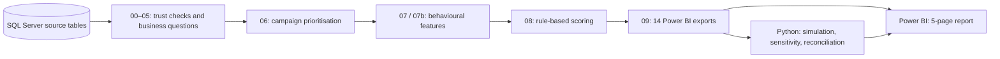

# ZaloPay Promotion-Abuse Detection

> A decision-focused portfolio case study: SQL finds behavioural signals, Python tests review rules, and Power BI turns the result into an operational review decision.

> **Scope note:** “suspicious” means a rule-based **review-priority signal**, not confirmed fraud. The source contains no labelled fraud outcomes, so the recommendation is for review/shadow mode—not automatic blocking.

## Explore the project

- [Open the interactive Power BI report](https://app.powerbi.com/view?r=eyJrIjoiZmM2NjBhZDUtMjVjYy00ZjcyLWEyMTEtMmZhMTkzZWM2Yzk0IiwidCI6IjNkZmNkMTY2LWYzZmUtNGQxNS1hNDYzLTA0NTU2YzMwNWZmMiIsImMiOjEwfQ%3D%3D)
- [Read the presentation in GitHub’s browser viewer](presentation/ZaloPay_Promotion_Abuse_Presentation.pdf)
- [Trace the SQL evidence](docs/01_sql_stage.md) · [review the Python simulation](docs/02_python_stage.md) · [see the Power BI design](docs/03_powerbi_stage.md) · [read the findings](docs/04_insights.md)

---

## 1. Business problem

### The scenario

A cashback/voucher campaign can drive growth, but its budget can also be concentrated among users with behaviours consistent with promotion extraction: rapid redemption, high captured discounts, referral farming, shared devices/IPs, and reciprocal transfer loops.

### The objective

**Which campaign users should be prioritised for manual review, and what share of promotion cost does that review queue cover?**

### KPIs

| KPI | Why it matters |
|---|---|
| Credited promotion cost | Budget actually paid on successful transactions |
| Suspicious-user rate | Review population size relative to all scored users |
| Suspicious cost share | Cost exposed to the review-priority population |
| Users flagged / user share | Manual-review workload |
| Cost captured by a rule | Coverage achieved by that workload |
| Retention | Context only; it is not campaign-causal proof |

---

## 2. Executive summary

### Key finding 1 — budget is concentrated before any rule is applied

`CAMP_A` contains **254,309 transactions** from **90,555 users**; **7.00bn ₫** was credited on successful transactions. One anonymised promotion, `PROMO_45`, accounts for **74.02%** of credited cost. Monitoring should focus on where the budget actually sits. [Check the output table](data/output/campaign_promotion_breakdown.csv).

### Key finding 2 — a small review-priority group is associated with a large cost share

Of **86,170 scored users**, **3,671 (4.26%)** score at least 3. They account for **26.94%** of credited promotion cost, approximately **1.89bn ₫**; the peak daily share reaches **40.70%**. [Check the reconciled impact summary](data/output/abuse_impact_summary.csv).

### Key finding 3 — a balanced rule is an operational starting point

The recommended **medium-balanced** rule flags **1,994 users (2.31%)** and covers **23.89%** of review-priority cost. It is suitable for **shadow mode / high-priority manual review**. Its 0% low-score impact is an internal-consistency proxy, not a measured false-positive rate.


### Recommendation

Run the medium-balanced rule in shadow mode, route its queue to investigators, prioritise the dominant promotion and high-exposure merchants, and collect investigator outcomes before considering automated action. See the [full recommendation and caveats](docs/04_insights.md).

---

## 3. Tech stack

| Tool | Role in the story | Evidence |
|---|---|---|
| **SQL Server / T-SQL** | Trust checks, campaign prioritisation, feature engineering, scoring and dashboard exports | [SQL stage](docs/01_sql_stage.md) · [`sql/`](sql/) |
| **Python / pandas** | Rule simulation, threshold sensitivity and independent SQL↔Python reconciliation | [Python stage](docs/02_python_stage.md) · [notebook](notebook/01_rule_simulation_storytelling.ipynb) |
| **Power BI** | Interactive stakeholder report with KPIs, exposure views, review decisions and retention context | [Live report](https://app.powerbi.com/view?r=eyJrIjoiZmM2NjBhZDUtMjVjYy00ZjcyLWEyMTEtMmZhMTkzZWM2Yzk0IiwidCI6IjNkZmNkMTY2LWYzZmUtNGQxNS1hNDYzLTA0NTU2YzMwNWZmMiIsImMiOjEwfQ%3D%3D) · [design notes](docs/03_powerbi_stage.md) |

---

## 4. Data pipeline



| Phase | What happens | Evidence to inspect |
|---|---|---|
| **1. SQL** | Validates data assumptions, selects the campaign, builds six signals and scores users | [`sql/README.md`](sql/README.md) · [`08_abuse_detection_rules_final.sql`](sql/08_abuse_detection_rules_final.sql) |
| **2. Python** | Rebuilds decision metrics, compares candidate rules, sweeps thresholds and reconciles with SQL | [notebook](notebook/01_rule_simulation_storytelling.ipynb) · [reconciliation output](data/output/python_rule_simulation/python_sql_reconciliation_summary.csv) |
| **3. Power BI** | Refreshes exported tables into a 5-page decision report | [live report](https://app.powerbi.com/view?r=eyJrIjoiZmM2NjBhZDUtMjVjYy00ZjcyLWEyMTEtMmZhMTkzZWM2Yzk0IiwidCI6IjNkZmNkMTY2LWYzZmUtNGQxNS1hNDYzLTA0NTU2YzMwNWZmMiIsImMiOjEwfQ%3D%3D) · [browser-viewable presentation](presentation/ZaloPay_Promotion_Abuse_Presentation.pdf) |

### Reproducibility proof

The Python and SQL implementations reconcile on every published headline check, including suspicious-user count, cost share and the SQL baseline rules. [Open the reconciliation table](data/output/python_rule_simulation/python_sql_reconciliation_summary.csv).


---

## 5. Repository architecture

```text
sql/                   00–09 T-SQL: trust → campaign choice → features → scoring → exports
notebook/              narrated Python rule-simulation and reconciliation notebook
scripts/               refresh/export/validation helpers; see docs/05_reproducibility_and_scripts.md
data/output/           anonymised aggregate outputs, evidence CSVs and simulation charts
data/anon_data_source/ anonymised Power BI input sources
dashboard/             public Power BI report (.pbix) and theme
presentation/          stakeholder presentation PDF (viewable in GitHub)
docs/                  evidence-led stage notes and findings
```

### What are the scripts for — are they all needed?

No. The live Power BI report, presentation, output charts and docs are all a reviewer needs to understand the story. The scripts are for **refreshing and validating** the project, not for reading it. [See the script-by-script guide](docs/05_reproducibility_and_scripts.md).

---

## Privacy and limitations

- Raw data and original identifiers are excluded. Public sources use anonymised campaign, promotion, merchant and user identifiers.
- User-level public files are sampled; aggregate outputs remain intact so the narrative can be checked.
- The score is a prioritisation rule, not a fraud classifier. The project recommends review/shadow mode, not automated blocking.
- Retention is overall-payment context and does not demonstrate campaign-attributed retention by risk group.

## Suggested review order

1. [Open the live Power BI report](https://app.powerbi.com/view?r=eyJrIjoiZmM2NjBhZDUtMjVjYy00ZjcyLWEyMTEtMmZhMTkzZWM2Yzk0IiwidCI6IjNkZmNkMTY2LWYzZmUtNGQxNS1hNDYzLTA0NTU2YzMwNWZmMiIsImMiOjEwfQ%3D%3D).
2. Read the [findings and recommendation](docs/04_insights.md).
3. Open the [presentation PDF in GitHub](presentation/ZaloPay_Promotion_Abuse_Presentation.pdf).
4. If you want to audit the logic, follow [SQL](docs/01_sql_stage.md) → [Python](docs/02_python_stage.md) → [Power BI](docs/03_powerbi_stage.md).
