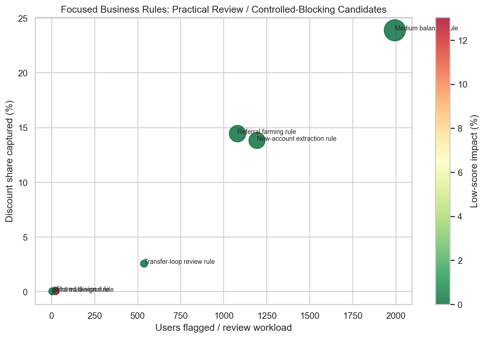
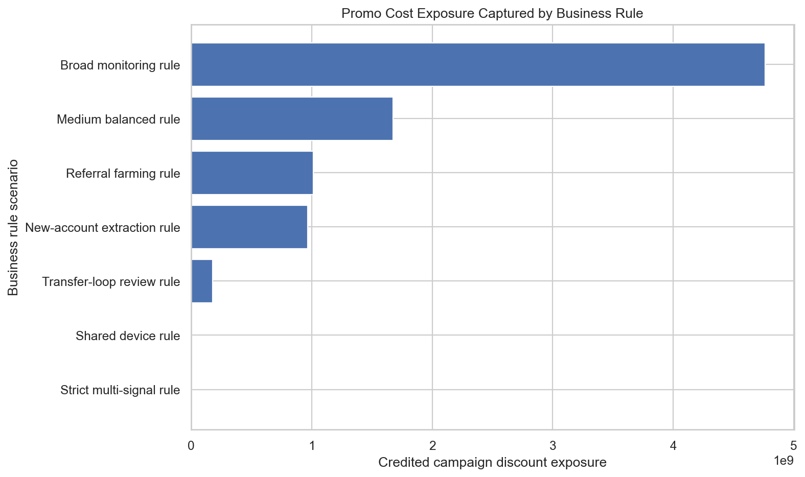

# Insights & Recommendation

The narrative a stakeholder should walk away with — in plain business terms. Every key claim below links to an anonymised output in this repository.

## 1. The promotion worked, but its budget is concentrated

Campaign `CAMP_A` drove **254,309 transactions** from **90,555 users** at a **76.01% success rate**, spending **7.00bn ₫** in credited promotion cost. That spend is not evenly distributed: `PROMO_45` accounts for **74.02%** of credited cost. Monitoring effort should be concentrated where the budget is concentrated.

**Proof:** [campaign overview](../data/output/campaign_overview.csv) · [promotion-level cost breakdown](../data/output/campaign_promotion_breakdown.csv)

## 2. A small group of users absorbs a large share of the budget

Of **86,170 scored users**, **3,671 (4.26%)** score as suspicious on the six-signal model. They hold **26.94% of credited promotion cost (≈1.89bn ₫)**. On the highest-exposure day, they account for **40.70%** of that day’s credited cost.

> **Slide headline:** *4.26% of users → 26.94% of promotion cost.*

**Proof:** [impact summary](../data/output/abuse_impact_summary.csv) · [daily exposure by risk group](../data/output/campaign_daily_risk_summary.csv)

## 3. Suspicion is multi-signal, not one behaviour

The score combines immediate discount redemption, credited discount, referrals, device sharing, IP sharing and reciprocal transfer loops. It is deliberately not a one-signal ban rule: high credited discount, transfer loops and shared IPs are more informative when they occur together than alone.

The score is an **investigation-priority mechanism**, not proof of fraud. That distinction is essential because no confirmed fraud/bot labels exist in the source data.

## 4. The right action is prioritised review, not automated blocking

The **medium-balanced** rule is the recommendation:

- flags **1,994 users** — **2.31%** of the scored population;
- covers **23.89%** of review-priority cost;
- has **0% low-score impact** only as an internal-consistency proxy, not as a proven false-positive rate.

**Proof:** [all rule metrics](../data/output/python_rule_simulation/python_business_rule_simulation_summary.csv) · [SQL↔Python reconciliation](../data/output/python_rule_simulation/python_sql_reconciliation_summary.csv)

## 5. Retention is context, not proof

Overall-payment retention is displayed as context. It does **not** measure campaign-attributed retention by risk group, so it cannot prove the campaign acquired only one-time extractors. The next analysis should build campaign-scoped retention by risk group.

## Recommendation summary

| Do now | Why |
|---|---|
| Put the medium-balanced rule into **shadow mode / manual review** | Best tested coverage-to-workload trade-off |
| Prioritise `PROMO_45` and high-exposure merchants | 74.02% of credited cost is in one promotion |
| Keep the “review score, not fraud” disclaimer visible | Prevents over-action on unlabeled data |
| Collect investigator outcomes | Creates labels required to evaluate false positives and future blocking |

## What I would do next

Build network/ring features across referrals, devices and transfers; add first-hour velocity; test an anomaly model as a second opinion; and validate the rule against investigator outcomes before moving beyond review mode.
