# SQL Result Screenshots - ZaloPay Campaign Abuse Detection Project

This document records the SQL result screenshots used during the analysis.  
Each screenshot is documented with:

```text
Question answered:
Key result:
Business interpretation:
Next step:
```

The goal is to make the SQL workflow read like an analysis story, not only a list of query outputs.

---

## Project SQL Flow

```text
00_database_overview.sql
-> 01_table_schema_check.sql
-> 02_sample_all_tables.sql
-> 03_data_quality_check.sql
-> 04_relationship_check.sql
-> 05_business_questions.sql
-> 06_campaign_discovery_scan.sql
-> 07_selected_campaign_deep_dive.sql
-> 08_abuse_detection_rules_final.sql
```

---

## `00_database_overview.sql`


**Confirm current database**

**Question answered:** Am I running the SQL queries inside the correct database

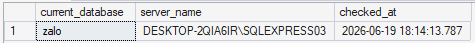

**Key result:** The query confirms that the active database is `zalo`.

**Business interpretation:** This prevents accidentally running analysis on the wrong database or project.

**Next step:** Proceed to list the available tables in the `zalo` database.

---

**List all user tables**

**Question answered:** What user-created tables exist in the database

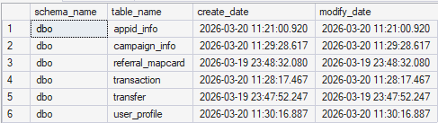

**Key result:** The database contains the main analytical tables: `transaction`, `transfer`, `user_profile`, `referral_mapcard`, `campaign_info`, and `appid_info`.

**Business interpretation:** The dataset is relational and contains both fact tables and lookup/dimension tables, which is suitable for BI/DA analysis.

**Next step:** Check row volume for each table to understand the scale of the dataset.

---

**Row count for each table**

**Question answered:** How many rows does each table contain

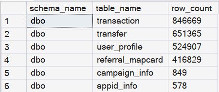

**Key result:** The largest tables are `transaction`, `transfer`, `user_profile`, and `referral_mapcard`. The lookup tables `campaign_info` and `appid_info` are much smaller.

**Business interpretation:** This confirms that most analysis work will happen on user activity tables, while campaign and app tables provide metadata for joins.

**Next step:** Check table size to understand storage and performance considerations.

---

**Table size overview**

**Question answered:** Which tables take the most storage space

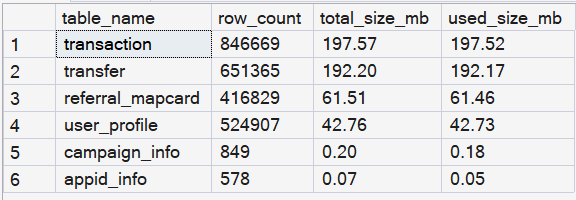

**Key result:** The `transaction` and `transfer` tables are the largest by storage size.

**Business interpretation:** These two tables represent the most detailed behavioral data and will likely drive most SQL runtime and optimization needs.

**Next step:** Move to schema checking to understand column names, data types, and nullable fields.

---

**Section takeaway - `00_database_overview.sql`**

The database contains 6 relational tables with around 2.44M total rows. The dataset is large enough to support a realistic SQL-based DA/BI project involving campaign analysis, payment behavior, referral relationships, transfer behavior, and abuse detection.

---

## `01_table_schema_check.sql`


**Table schema check**

**Question answered:** What columns, data types, and nullable fields exist in each table

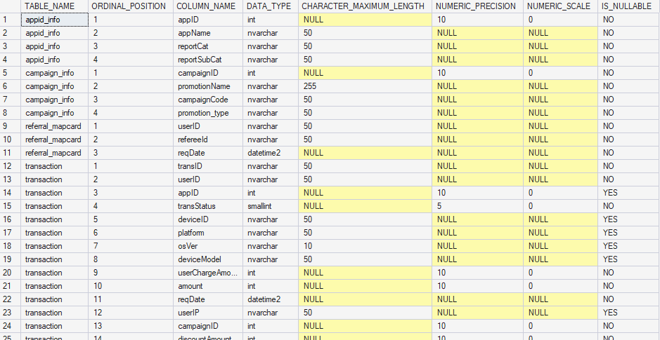

**Key result:** The query lists table names, column positions, column names, data types, precision/length, and nullability.

**Business interpretation:** This step creates the data dictionary needed before writing joins, filters, and feature logic. It also helps avoid errors like using the wrong column name.

**Next step:** Sample records from each table to understand what the columns mean in real data.

---

## `02_sample_all_tables.sql`


**`appid_info` sample**

**Question answered:** What merchant/app metadata is available

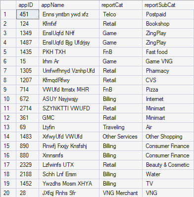

**Key result:** `appid_info` maps `appID` to `appName`, `reportCat`, and `reportSubCat`.

**Business interpretation:** This table supports merchant category analysis, such as payment behavior by Telco, Billing, Marketplace, Game, etc.

**Next step:** Review `campaign_info` to understand campaign metadata.

---

**`campaign_info` sample**

**Question answered:** What campaign metadata is available

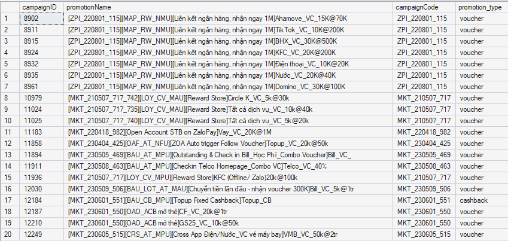

**Key result:** `campaign_info` maps `campaignID` to `promotionName`, `campaignCode`, and `promotion_type`.

**Business interpretation:** This table is essential for filtering and analyzing campaignCode `ZPI_220801_115`.

**Next step:** Review referral relationships.

---

**`referral_mapcard` sample**

**Question answered:** How are inviter and invitee relationships stored

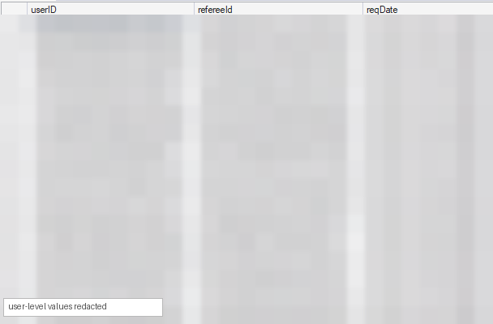

**Key result:** `userID` represents the inviter, `refereeId` represents the invitee, and `reqDate` records the referral request time.

**Business interpretation:** This table is critical for referral farming analysis and inviter/invitee network behavior.

**Next step:** Review transaction records.

---

**`transaction` sample**

**Question answered:** What does a transaction record contain

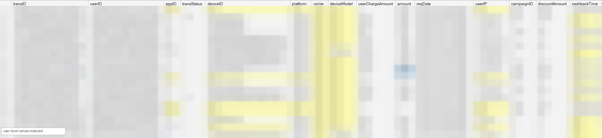

**Key result:** `transaction` contains user payment/campaign activity, transaction status, device/IP, amount, discount amount, appID, campaignID, and timestamps.

**Business interpretation:** This is the core fact table for campaign performance, promo cost, user behavior, and suspicious transaction patterns.

**Next step:** Review transfer records.

---

**`transfer` sample**

**Question answered:** What does a transfer record contain

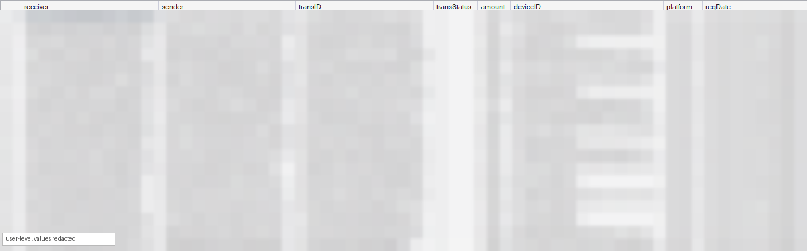

**Key result:** `transfer` contains sender, receiver, amount, transaction status, device/platform, and request time.

**Business interpretation:** This table supports transfer-loop analysis, such as A -> B then B -> A within a short time window.

**Next step:** Review user profile records.

---

**`user_profile` sample**

**Question answered:** What user profile metadata is available

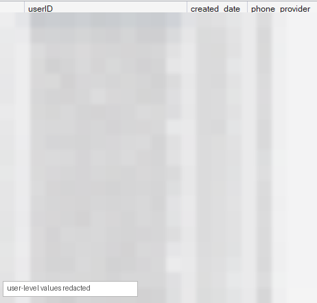

**Key result:** `user_profile` contains `userID`, `created_date`, and phone provider information.

**Business interpretation:** This table supports new-account behavior checks, especially comparing account creation date to transaction activity.

**Next step:** Move to data quality checks before deeper analysis.

---

**Section takeaway - `02_sample_all_tables.sql`**

The sample records confirm the core analytical roles of each table: `transaction` and `transfer` are behavior/event tables; `user_profile` provides user account context; `referral_mapcard` gives inviter-invitee relationships; `campaign_info` and `appid_info` provide metadata for campaign and merchant analysis.

---

## `03_data_quality_check.sql`


**Row counts**

**Question answered:** Do the imported tables have the expected row volumes

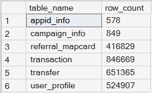

**Key result:** The row counts match the overview: `transaction`, `transfer`, `user_profile`, and `referral_mapcard` are the major tables, while `campaign_info` and `appid_info` are lookup tables.

**Business interpretation:** This confirms the SQL import was successful and gives a baseline for later joins and aggregations.

**Next step:** Check duplicate IDs in key tables.

---

**Duplicate check - transaction ID**

**Question answered:** Are there duplicate `transID` values in the `transaction` table

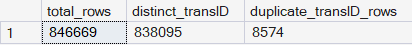

**Key result:** The result shows that `transID` is not fully unique in `transaction`; duplicate transaction IDs exist.

**Business interpretation:** This is an important data quality finding. Later queries should use `COUNT(DISTINCT transID)` when unique transaction count is needed, and `COUNT(*)` when row-level records are intentionally counted.

**Next step:** View duplicated examples to understand the pattern.

---

**Duplicated `transID` examples**

**Question answered:** What do duplicated transaction IDs look like

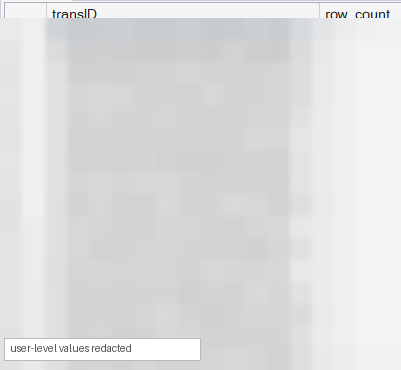

**Key result:** The example output shows duplicated `transID` values and their row counts.

**Business interpretation:** This helps confirm the duplicate issue is real, not just a summary error. It also warns that transaction-row count and distinct-transaction count can produce different answers.

**Next step:** Check whether lookup/master tables have duplicate keys.

---

**Duplicate check - `appid_info` and `campaign_info` master keys**

**Question answered:** Are the lookup table keys `appID` and `campaignID` unique

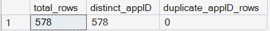

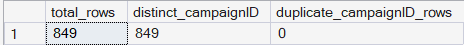

**Key result:** The master tables do not show duplicate key issues.

**Business interpretation:** This means `appid_info` and `campaign_info` can be safely used as lookup tables without multiplying rows unexpectedly in joins.

**Next step:** Check the date range of the main event tables.

---

**Basic date ranges**

**Question answered:** What time period does the dataset cover

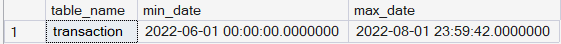

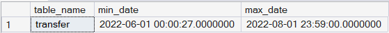

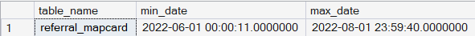


**Key result:** The main event tables cover the campaign activity period around June to early August 2022, while `user_profile` contains older account creation dates.

**Business interpretation:** This confirms that user accounts can be much older than the campaign window, which matters when distinguishing existing users from new-account behavior.

**Next step:** Check missing values in important transaction fields.

---

**Missing-value check for important transaction fields**

**Question answered:** Which important transaction fields contain missing values

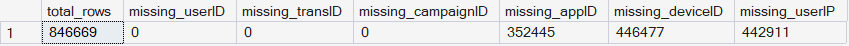

**Key result:** Some fields such as `appID`, `deviceID`, and `userIP` can be missing, while core user and transaction fields are usable.

**Business interpretation:** Missing `appID` does not automatically mean bad data. Some campaign/reward/cashback rows may not be merchant payment rows. Device/IP missingness should be handled carefully in abuse rules.

**Next step:** Check transaction status distribution.

---

**Transaction status distribution**

**Question answered:** How many transaction rows are successful vs failed or other statuses

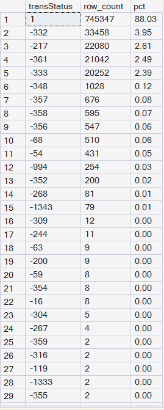

**Key result:** `transStatus = 1` is the dominant successful status, while negative status codes represent unsuccessful/failed statuses.

**Business interpretation:** For campaign cost, payment retention, and abuse detection, successful transactions should usually be filtered with `transStatus = 1`.

**Next step:** Check campaign code distribution.

---

**Campaign code distribution**

**Question answered:** Which campaign codes appear most frequently in transaction data

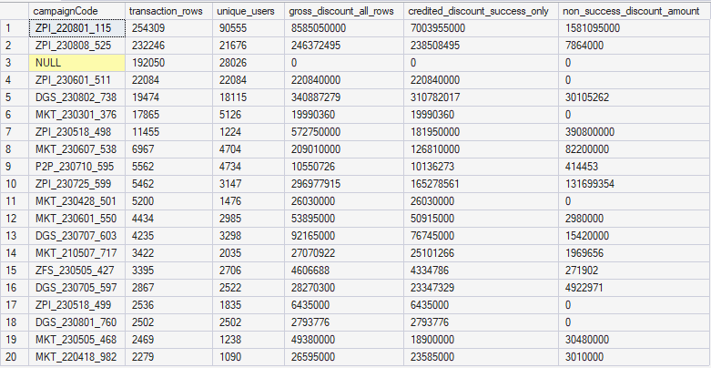

**Key result:** The result shows multiple campaign codes with different volumes and campaign activity levels.

**Business interpretation:** This supports the need for a campaign discovery step before deep-diving into one selected campaign.

**Next step:** Run exploratory checks for referral, platform, device/IP, new-account, and transfer-loop patterns.

---

### Additional exploratory checks from early file-checking

These checks helped clarify confusing table behavior and possible abuse signals before the final file structure was cleaned into `06`, `07`, and `08`.


**High-referral inviters**

**Question answered:** Which users invited unusually many invitees

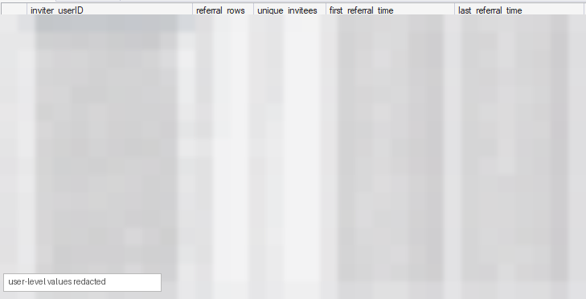

**Key result:** Some inviters have very high referral counts and long referral activity windows.

**Business interpretation:** High referral count can indicate strong legitimate acquisition activity, but it can also indicate referral farming when combined with high discount, shared devices/IPs, or transfer-loop activity.

**Next step:** Check whether invitees are invited by more than one inviter.

---

**Invitees invited more than once**

**Question answered:** Are some invitees linked to multiple inviters

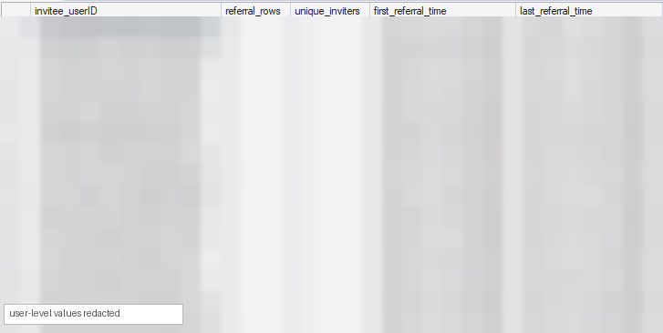

**Key result:** The result shows invitees that appear under more than one inviter.

**Business interpretation:** Multiple-inviter behavior can suggest referral manipulation or repeated campaign attempts, but needs additional evidence before being treated as abuse.

**Next step:** Check how transfer data relates to transaction data.

---

**Transfer rows matched to transaction rows**

**Question answered:** Are peer-to-peer transfers already included inside the `transaction` table

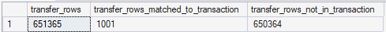

**Key result:** Only a small portion of transfer rows match transaction rows by transaction ID.

**Business interpretation:** `transfer` should be treated as a separate behavior table, not just a subset of `transaction`.

**Next step:** Validate whether transfer sender/receiver IDs exist in user profile.

---

**Transfer users exist in user profile**

**Question answered:** Do transfer senders and receivers exist in `user_profile`

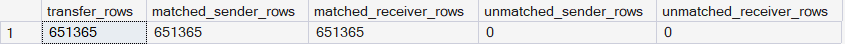

**Key result:** All transfer senders and receivers match users in `user_profile`.

**Business interpretation:** This confirms transfer behavior can be safely linked to user metadata such as account creation date.

**Next step:** Check whether transfer users also appear in transaction history.

---

**Transfer users appearing in transaction history**

**Question answered:** Do transfer senders/receivers also have transaction activity


**Key result:** Some transfer users also appear in `transaction`, while some may only appear in transfer behavior.

**Business interpretation:** This helps separate payment/campaign users from users involved mostly in peer-to-peer transfer behavior.

**Next step:** Check platform distribution.

---

**Platform distribution in `transaction`**

**Question answered:** How are transaction rows distributed by platform

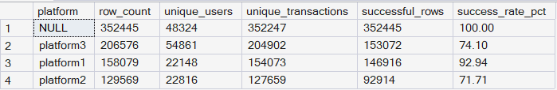

**Key result:** The transaction table includes platform values and some NULL platform rows.

**Business interpretation:** Platform NULL needs interpretation. It may represent non-merchant campaign/reward/cashback rows rather than data failure.

**Next step:** Compare with transfer platform distribution.

---

**Platform distribution in `transfer`**

**Question answered:** How are transfer rows distributed by platform

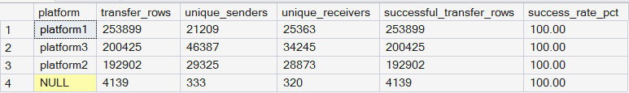

**Key result:** Transfer rows are distributed across available platforms and show successful transfer behavior.

**Business interpretation:** This supports platform-level behavior checks, but platform alone is not enough to define abuse.

**Next step:** Explore initial abuse-signal checks.

---

**Referral abuse signal**

**Question answered:** Which users show high referral activity

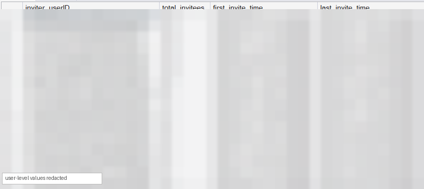

**Key result:** The result identifies users with high invitee counts.

**Business interpretation:** High referral volume is a useful suspicious signal when combined with campaign reward extraction or other risk signals.

**Next step:** Check shared device behavior.

---

**Device abuse signal**

**Question answered:** Which device IDs are shared by many users

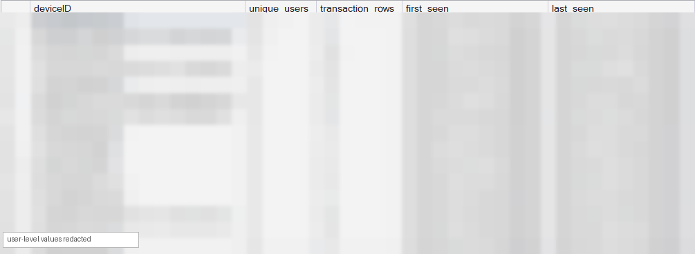

**Key result:** The result identifies device IDs used by multiple users.

**Business interpretation:** Shared device is a stronger signal than shared IP because one device should usually not be used by many unrelated users.

**Next step:** Check shared IP behavior.

---

**IP abuse signal**

**Question answered:** Which IP addresses are shared by many users

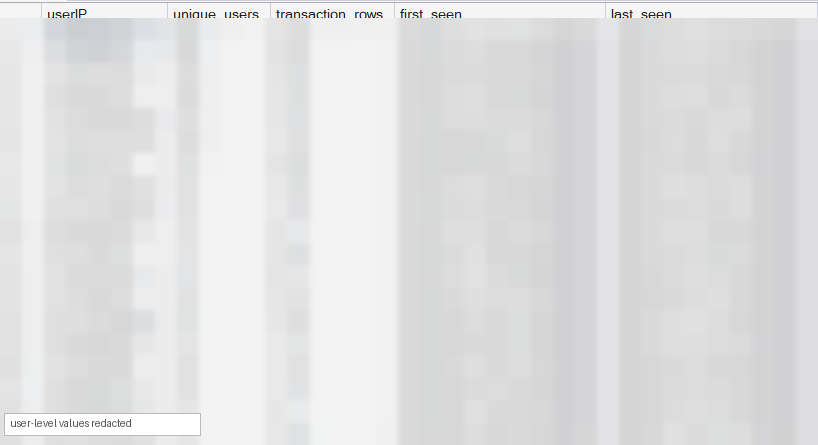

**Key result:** The result identifies IP addresses used by many users.

**Business interpretation:** IP sharing is suspicious but weaker than device sharing because office Wi-Fi, dorms, public Wi-Fi, or mobile networks can produce many legitimate users on one IP.

**Next step:** Use IP only as a supporting signal, not a standalone abuse rule.

---

**New-account abuse exploration**

**Question answered:** Are newly created accounts earning high discounts quickly

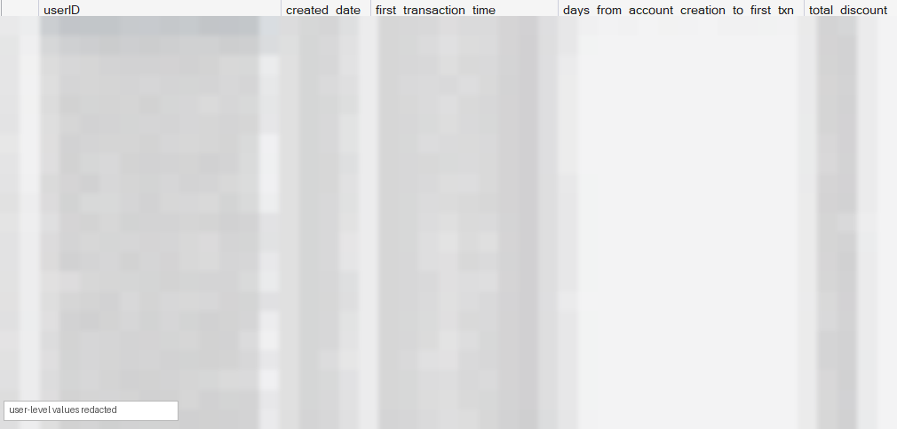

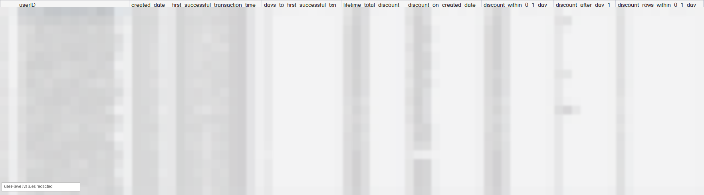

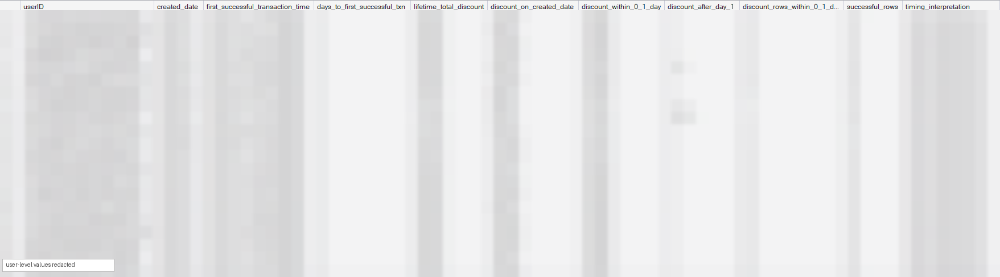

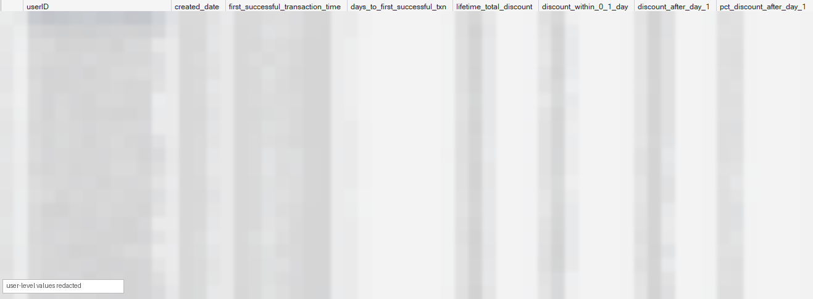

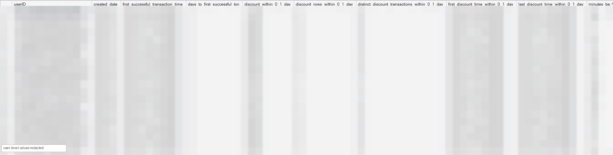

**Key result:** The results explore users whose transactions and discounts happened close to account creation.

**Business interpretation:** This helped refine the logic: new account + early transaction is not abuse by itself. The stronger signal is high immediate discount extraction, especially with many discount rows.

**Next step:** Separate immediate discount from later lifetime discount to reduce false positives.

---

**Transfer-loop abuse exploration**

**Question answered:** Do users send money back and forth quickly

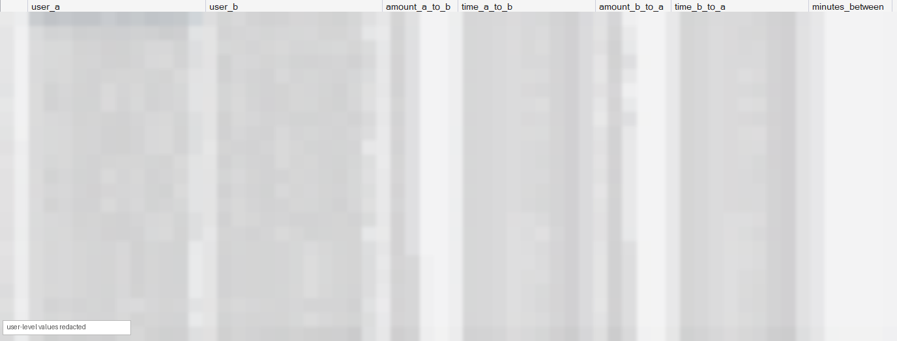

**Key result:** The result identifies A -> B -> A transfer loops within a short time window.

**Business interpretation:** Transfer loops can indicate money recycling to create fake activity or satisfy campaign requirements, especially when combined with high campaign discount or referral signals.

**Next step:** Verify the meaning of NULL platform records.

---

**Verify platform NULL behavior**

**Question answered:** Are NULL platform rows broken data or a meaningful transaction type

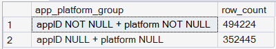

**Key result:** The check suggests NULL platform rows can be related to non-merchant, reward, or cashback campaign records.

**Business interpretation:** This avoids incorrectly treating all NULL platform rows as bad data. They should be interpreted based on campaign/payment context.

**Next step:** Move to formal relationship checks.

---

## `04_relationship_check.sql`


**`transaction` -> `campaign_info`**

**Question answered:** Do transaction campaign IDs match the campaign lookup table

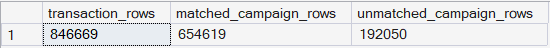

**Key result:** Most campaign-related rows match `campaign_info`. The unmatched campaign records are explained by `campaignID = 0`.

**Business interpretation:** `campaignID = 0` likely represents non-campaign transactions, not broken campaign metadata.

**Next step:** Inspect unmatched campaign IDs to confirm the cause.

---

**Unmatched campaignID examples**

**Question answered:** Which campaign IDs do not match `campaign_info`

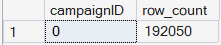

**Key result:** The unmatched rows are concentrated in `campaignID = 0`.

**Business interpretation:** This supports treating campaignID 0 as non-campaign activity and filtering it out when doing campaign analysis.

**Next step:** Validate appID joins for payment transactions.

---

**`transaction` -> `appid_info` for payment transactions**

**Question answered:** Do payment transaction app IDs match the app lookup table

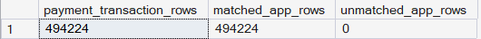

**Key result:** For payment transactions where `appID > 0`, app IDs match `appid_info`.

**Business interpretation:** Merchant/category analysis using `reportCat` and `reportSubCat` is reliable for payment transactions.

**Next step:** Inspect unmatched appID examples.

---

**Unmatched appID examples**

**Question answered:** Are there app IDs that fail to match the lookup table


**Key result:** No meaningful unmatched appID examples appear for payment transactions.

**Business interpretation:** This confirms that missing/NULL `appID` should be treated differently from invalid `appID`; many non-payment rows simply do not need merchant metadata.

**Next step:** Validate transaction user IDs.

---

**`transaction` -> `user_profile`**

**Question answered:** Does every transaction user exist in user profile

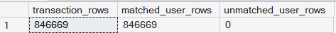

**Key result:** All transaction user IDs match `user_profile`.

**Business interpretation:** User-level transaction analysis is reliable, including account-age and new-account behavior checks.

**Next step:** Validate referral inviter and invitee IDs.

---

**`referral_mapcard` inviter/referee -> `user_profile`**

**Question answered:** Do all inviters and invitees exist in user profile

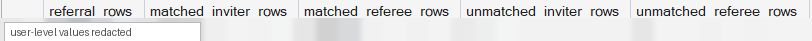

**Key result:** All referral inviters and invitees match `user_profile`.

**Business interpretation:** Referral network analysis is structurally reliable.

**Next step:** Validate transfer sender and receiver IDs.

---

**`transfer` sender/receiver -> `user_profile`**

**Question answered:** Do all transfer senders and receivers exist in user profile

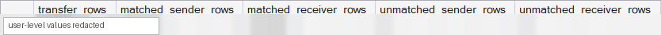

**Key result:** All transfer senders and receivers match `user_profile`.

**Business interpretation:** Transfer-loop analysis can be connected to valid user accounts.

**Next step:** Move to the official business questions.

---

**Section takeaway - `04_relationship_check.sql`**

The main joins are reliable. CampaignID 0 should be treated as non-campaign activity; payment appIDs with `appID > 0` match app metadata; transaction, referral, and transfer user IDs all connect to `user_profile`.

---

## `05_business_questions.sql`


**Top 5 `reportCat` by payment transactions**

**Question answered:** Which merchant categories have the highest payment transaction volume

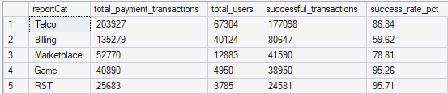

**Key result:** Telco is the largest category by payment transactions, followed by Billing, Marketplace, Game, and RST.

**Business interpretation:** This answers the assessment's category-level payment analysis question and shows which merchant areas dominate payment activity.

**Next step:** Calculate when users first exceed 100K cumulative discount.

---

**First time each user earned more than 100K total discount**

**Question answered:** For each user, when did cumulative discount first exceed 100K

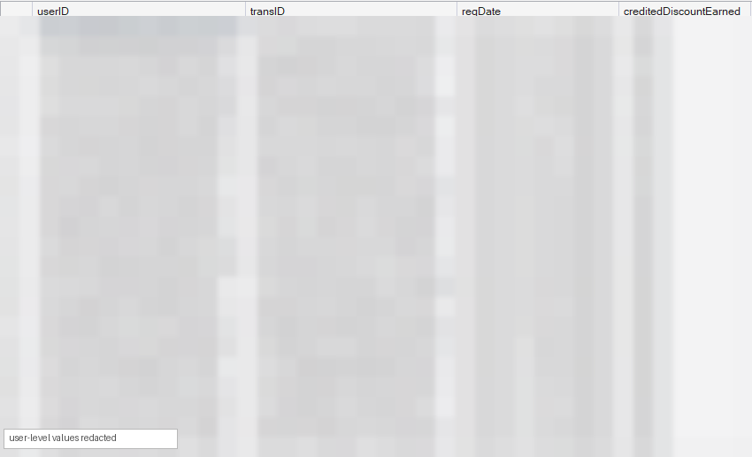

**Key result:** The result returns the first successful transaction for each user where running credited discount passed 100K.

**Business interpretation:** This is not a single-transaction discount check. It uses cumulative success-only credited discount over time, matching the fixed promotion-cost calculation standard.

**Next step:** Calculate weekly payment retention.

---

**Weekly payment retention**

**Question answered:** After first successful payment week, how many users came back in later weeks

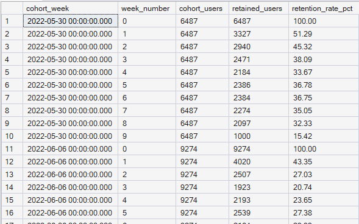

**Key result:** The result shows cohort week, week number, cohort users, retained users, and retention rate.

**Business interpretation:** This answers whether paying users return after their first payment week. Week 0 is 100% by definition because it is the first payment week.

**Next step:** Move from basic business questions to campaign discovery.

---

## `06_campaign_discovery_scan.sql`


**Campaign overview and ranking**

**Question answered:** Which campaigns stand out by transaction volume, user count, and credited success-only discount cost

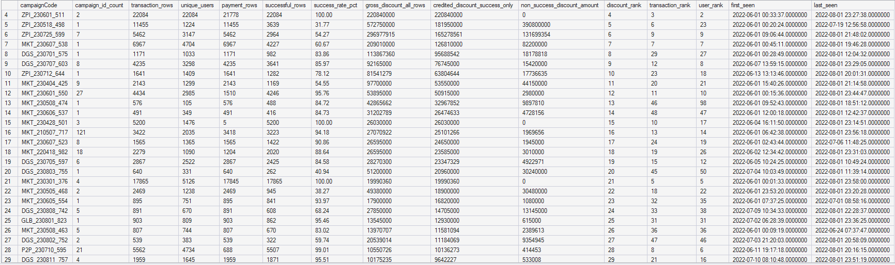

**Key result:** `ZPI_220801_115` ranks at the top by credited success-only discount, transaction volume, and unique users.

**Business interpretation:** Because failed/non-success discounts are separated from credited promo cost, `ZPI_220801_115` remains a strong deep-dive candidate using the corrected metric.

**Next step:** Scan campaign-level suspicious signals.

---

**Campaign-level suspicious signal scan**

**Question answered:** Which campaigns show high-discount users or suspicious-user indicators

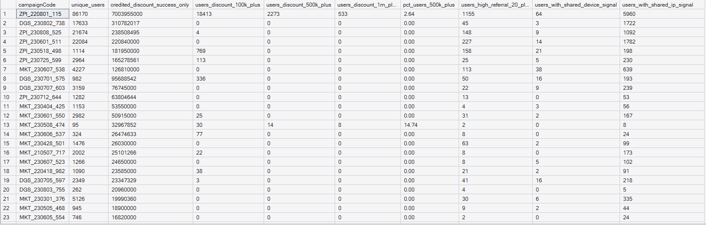

**Key result:** `ZPI_220801_115` has the largest credited success-only discount exposure and many users crossing discount thresholds.

**Business interpretation:** This suggests that the campaign is not only large but also has meaningful credited promotional-risk exposure after removing non-success discount noise.

**Next step:** Create a campaign priority score to rank investigation candidates.

---

**Campaign priority score**

**Question answered:** Which campaigns should be prioritized for deep-dive investigation

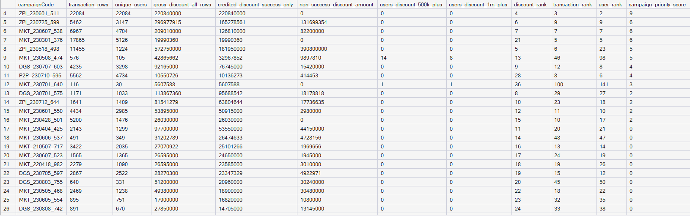

**Key result:** `ZPI_220801_115` appears as the strongest investigation candidate using volume, user count, credited discount, and high-discount-user signals.

**Business interpretation:** This gives a data-driven reason for selecting the campaign for deeper analysis instead of blindly starting from the target campaign.

**Next step:** Inspect promotion-name/campaignID breakdown to understand which promotion mechanics drive cost.

---

**Promotion-name breakdown across campaigns**

**Question answered:** Which promotion names or campaign IDs drive the largest credited success-only discount cost across campaigns


**Key result:** The result identifies the highest-cost promotion-level records across campaigns and separates gross discount, credited success-only discount, and non-success discount amount.

**Business interpretation:** This connects corrected campaign-level promo cost to specific promotion mechanics and prepares the selected-campaign deep dive.

**Next step:** Move to the selected campaign deep dive.

---

**Section takeaway - `06_campaign_discovery_scan.sql`**

The broad scan shows that `ZPI_220801_115` is the most noticeable campaign by scale and credited success-only discount exposure. This justifies moving from all-campaign discovery to a focused campaign deep dive.

---

## `07_selected_campaign_deep_dive.sql`


**Selected campaign overview**

**Question answered:** How large is the selected campaign and what is its overall performance


**Key result:** The result summarizes transactions, users, campaign IDs, success rate, gross discount, credited success-only discount, non-success discount, and active date range for `ZPI_220801_115`.

**Business interpretation:** This establishes the selected campaign size and credited cost exposure before reviewing user-level abuse signals.

**Next step:** Break down the campaign by promotion ID/name.

---

**Promotion-level breakdown inside selected campaign**

**Question answered:** Which promotion IDs within the selected campaign drive the most transactions and credited success-only discount cost


**Key result:** The result shows promotion-level transaction rows, users, successful rows, gross discount, credited success-only discount, and non-success discount.

**Business interpretation:** This identifies which reward mechanics or campaign IDs contribute most to credited promo cost and may deserve stricter controls.

**Next step:** Review the daily trend to detect spikes.

---

**Daily campaign trend**

**Question answered:** When did selected-campaign activity and cost happen over time


**Key result:** The daily trend shows transaction volume, user count, successful rows, gross discount, credited success-only discount, and non-success discount by date.

**Business interpretation:** Daily spikes in credited success-only discount may point to promotion abuse bursts, campaign launch effects, or operational events worth investigating.

**Next step:** Check top users by campaign discount.

---

**Top users by selected-campaign discount**

**Question answered:** Which users consumed the most promotional value in the selected campaign


**Key result:** The result ranks users by credited success-only campaign discount and successful transaction count.

**Business interpretation:** This is a credited cost-concentration view, not a fraud label yet. High discount users need additional signals before being flagged.

**Next step:** Check whether high discount happened immediately after account creation.

---

**New-account immediate discount behavior**

**Question answered:** Did newly created accounts earn high discount quickly after account creation


**Key result:** The result identifies users with early successful campaign activity and credited immediate discount within 0-1 day.

**Business interpretation:** This is a stronger suspicious signal than simply being a new user. It indicates fast credited reward extraction when combined with high discount rows.

**Next step:** Check referral behavior of selected-campaign users.

---

**Referral behavior of selected-campaign users**

**Question answered:** Which selected-campaign users invited many other users


**Key result:** The result ranks selected-campaign users by total invitees.

**Business interpretation:** High referral count can indicate referral farming when combined with high campaign discount, immediate reward extraction, shared device/IP, or transfer-loop behavior.

**Next step:** Check shared device and IP signals among selected-campaign users.

---

**Shared device and IP signals among selected-campaign users**

**Question answered:** Do selected-campaign users share devices or IPs with many users


**Key result:** The result identifies shared device and shared IP clusters among users connected to the selected campaign.

**Business interpretation:** Shared device is a stronger suspicious signal; shared IP is useful but should be treated as supporting evidence because many legitimate users can share an IP.

**Next step:** Move to final user-level abuse scoring.

---

**Section takeaway - `07_selected_campaign_deep_dive.sql`**

The selected campaign is large, costly on a credited success-only basis, and shows user-level risk patterns such as high discount concentration, rapid new-account reward extraction, high referral counts, and shared device/IP clusters. These findings provide the input signals for the final abuse-detection rules.

---

## `08_abuse_detection_rules_final.sql`


**Final suspicious-user scored output**

**Question answered:** Which selected-campaign users should be prioritized for risk review


**Key result:** The output ranks users by `suspicion_score` and includes fixed promotion-cost signal columns such as `credited_campaign_discount_success_only`, `immediate_discount_0_1_day`, referral count, shared device/IP, transfer-loop count, and reason text.

**Business interpretation:** This is the final rule-based suspicious-user table. Users are not flagged by one weak signal alone; they are prioritized when multiple suspicious signals appear together.

**Next step:** Use the full table for analyst review and export the required `userID` + `reason` columns if submitting `result.xlsx`.

---

**Final output continuation / export view**

**Question answered:** What should be exported as the final deliverable


**Key result:** The result contains the required user-level suspicious output and supporting columns for review.

**Business interpretation:** For the assessment, the strict deliverable can be reduced to `userID` and `reason`. For the portfolio, keeping `suspicion_score`, `risk_tier`, and signal columns is better for explanation.

**Next step:** Use this output to estimate abuse impact and write prevention recommendations.

---

**Section takeaway - `08_abuse_detection_rules_final.sql`**

The final abuse-detection output is a scored suspicious-user list for `ZPI_220801_115`. It combines multiple signals: high credited campaign discount, high credited immediate discount, high referral count, shared device/IP, and transfer-loop behavior. The result should be interpreted as a risk-review candidate list, not a confirmed fraud label.

---

## Final SQL Workflow Summary

```text
00_database_overview.sql
Purpose: Confirm database structure and table scale.

01_table_schema_check.sql
Purpose: Understand columns, data types, and nullability.

02_sample_all_tables.sql
Purpose: Understand what each table means in real records.

03_data_quality_check.sql
Purpose: Validate row counts, duplicates, missing values, date ranges, status distribution, and early suspicious patterns.

04_relationship_check.sql
Purpose: Confirm that joins between transaction, campaign, app, user, referral, and transfer tables are reliable.

05_business_questions.sql
Purpose: Answer required SQL business questions: category payment volume, first 100K cumulative discount crossing, and weekly payment retention.

06_campaign_discovery_scan.sql
Purpose: Scan all campaigns to identify which campaign deserves deeper investigation.

07_selected_campaign_deep_dive.sql
Purpose: Analyze the selected campaign's performance, cost, user concentration, referral behavior, and supporting risk signals.

08_abuse_detection_rules_final.sql
Purpose: Generate final scored suspicious-user list for risk review.
```

**Overall project conclusion:**  
The SQL process is clean because it moves from database understanding -> data validation -> business questions -> campaign discovery -> selected campaign deep dive -> final abuse detection. SQL is the right tool for this stage because the work requires joins, aggregations, cohort logic, campaign-level ranking, and user-level rule scoring. Later, the SQL outputs can be handed off to Python, Power BI, or a written report for visualization and business communication.


